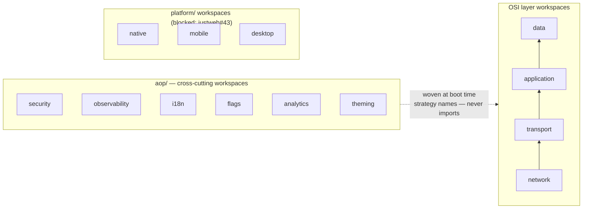
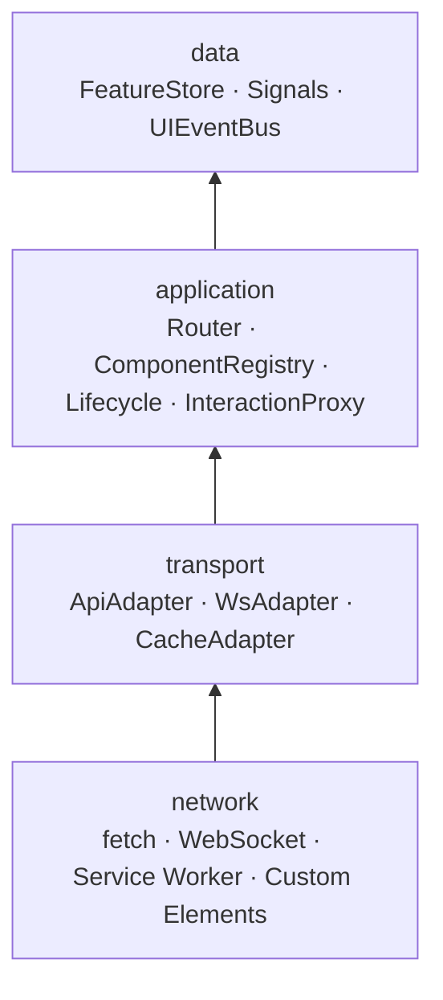
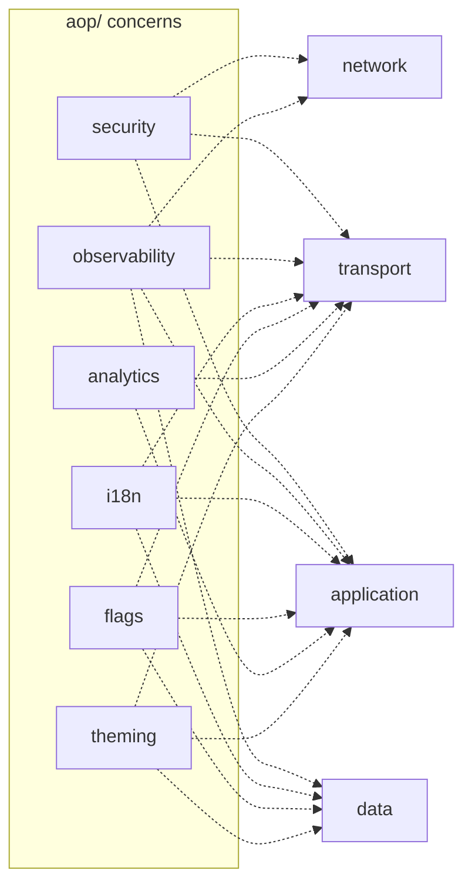
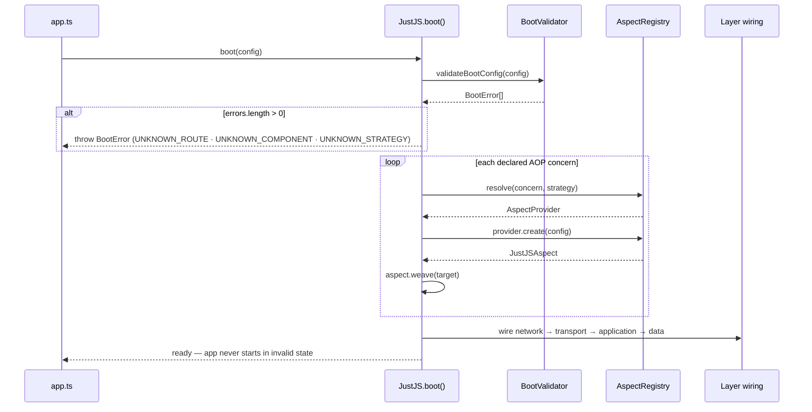
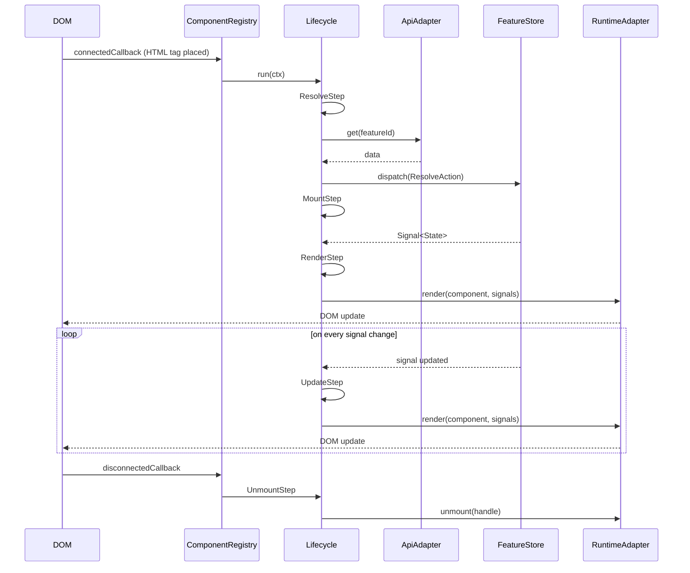
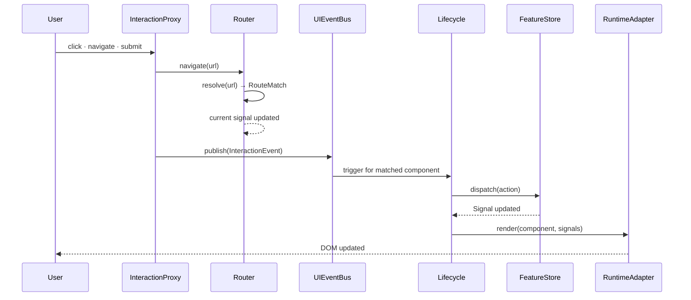
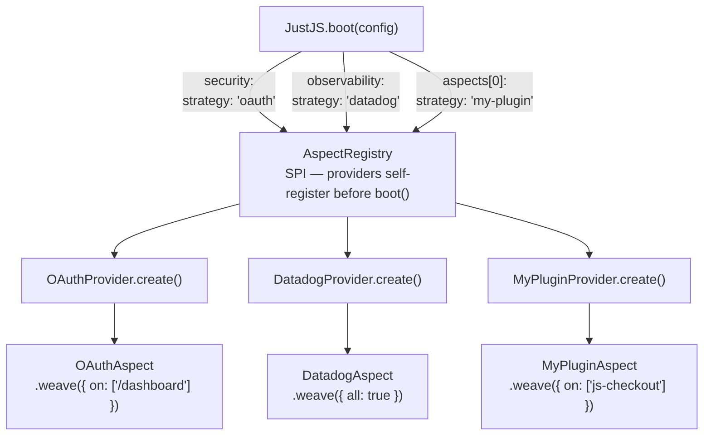

# JustJS — Architecture

## Overview

JustJS is the UI domain layer. The developer writes a `*_component.yaml` and places an HTML tag. Everything else flows — routing, auth, state, API transport, lifecycle, CSS, observability, platform delivery.

**Core principle:** all wiring is declared at boot time by strategy name, resolved through SPI, never by direct import. Swap a strategy name — nothing else changes.

---

## Workspace structure

Every layer, every AOP concern, and every platform adapter is a **standalone workspace** — installable, buildable, testable, and runnable in complete isolation. `bun-workspace.yaml` at the repo root is a convenience only; nothing depends on it to function.



```
justjs/
  network/scm/main/src/{api,core,saf,spi}
  transport/scm/main/src/{api,core,saf,spi}
  application/scm/main/src/{api,core,saf,spi}
  data/scm/main/src/{api,core,saf,spi}

  aop/
    security/scm/main/src/{api,core,saf,spi}
    observability/scm/main/src/{api,core,saf,spi}
    i18n/scm/main/src/{api,core,saf,spi}
    flags/scm/main/src/{api,core,saf,spi}
    analytics/scm/main/src/{api,core,saf,spi}
    theming/scm/main/src/{api,core,saf,spi}

  platform/
    native/scm/main/src/{api,core,saf,spi}    blocked: justweb#43
    mobile/scm/main/src/{api,core,saf,spi}    blocked: justweb#43
    desktop/scm/main/src/{api,core,saf,spi}   blocked: justweb#43

  docs/
  bun-workspace.yaml
  package.json
```

---

## Layer model

Modelled on the OSI stack — each layer has a single responsibility and depends only on layers below it. Data flows upward from `network` to `data`.



`application/` is the consumer-facing layer — what developers plug and play into the system. The framework concerns (security, observability, i18n, flags, analytics, theming) do not live here; they are woven from outside.

---

## AOP — cross-cutting concerns

A concern lives in `aop/` when it must **operate at more than one layer**. Placing it inside a single layer would either leak implementation upward or force other layers to depend on concerns they should not know about — violating the OSI constraint.

| Concern | network | transport | application | data |
|---|---|---|---|---|
| security | token refresh | auth headers | route guards | — |
| observability | request timing | call logs | lifecycle events | state change tracking |
| i18n | — | locale file loading | render-time translation | locale state |
| flags | — | config fetch | component / route gating | flag state |
| analytics | — | event dispatch | interaction capture | — |
| theming | — | token file loading | CSS application | theme state |

Each concern is declared at boot time by strategy name, resolved through the SPI `AspectRegistry`, and woven onto its targets. No layer imports an AOP concern directly.



Errors are **not** an AOP concern — each layer's `api/` defines its own specific error types.

---

## SAF — Service Abstraction Framework

Every workspace follows the same four-directory layout under `scm/main/src/`:

| Directory | Name | Role |
|---|---|---|
| `api/` | Contracts | Interfaces, errors, types — zero dependencies |
| `core/` | Implementations | Business logic — never imported by consumers |
| `saf/` | Service Abstraction Facade | Sole public export surface |
| `spi/` | Service Provider Implementation | Extension hooks — providers self-register here |

Consumers import only from a workspace's `saf/` surface. The `core/` implementations are an internal detail.

---

## Boot sequence



Boot-time validation is a hard invariant: every route path and component tag in `.on([])` / `.except([])` is validated against `routes.gen.json` and `registry.gen.ts` before any layer starts. Unknown target = `BootError`.

---

## Component lifecycle



---

## User interaction — data flow



---

## Aspect weaving — SPI



Third-party strategies are separate repos that self-register before `JustJS.boot()` is called. The consumer never imports the strategy implementation.

---

## Interface inventory

Interfaces are organised by the workspace they belong to. Each workspace's `api/` also defines its own error types.

### network/

| Interface | File |
|---|---|
| `RuntimeAdapter` | `api/runtime.ts` |

### transport/

| Interface | File |
|---|---|
| `ApiAdapter` | `api/transport.ts` |
| `WsAdapter`, `WsConnection` | `api/transport.ts` |
| `CacheAdapter` | `api/transport.ts` |

### application/

| Interface | File |
|---|---|
| `Component<Props, State, Events>` | `api/component.ts` |
| `ComponentContext` | `api/component.ts` |
| `MountHandle` | `api/component.ts` |
| `LifecycleStep`, `Lifecycle` | `api/lifecycle.ts` |
| `LifecycleEvent`, `LifecycleEventType` | `api/lifecycle.ts` |
| `Route`, `RouteMatch`, `Router` | `api/router.ts` |
| `ComponentRegistry` | `api/router.ts` |
| `InteractionProxy`, `InteractionEvent` | `api/router.ts` |
| `JustJSAspect`, `AspectProvider`, `AspectRegistry` | `api/aspect.ts` |
| `AspectTarget`, `AspectConfig`, `AspectDeclaration` | `api/aspect.ts` |
| `BootConfig`, `BootError` | `api/boot.ts` |
| `RoutesManifest`, `RegistryManifest`, `ImportMap` | `api/boot.ts` |

### data/

| Interface | File |
|---|---|
| `Signal<T>`, `WritableSignal<T>` | `api/store.ts` |
| `FeatureStore<T, Selector>` | `api/store.ts` |
| `Action`, `UIEventBus`, `UIEvent` | `api/store.ts` |

### aop/security/

| Interface | File |
|---|---|
| `Principal`, `UISecurityContext` | `api/security.ts` |
| `RouteGuard` | `api/security.ts` |

### aop/observability/

| Interface | File |
|---|---|
| `UIObserverContext`, `LogDrain` | `api/observer.ts` |

### aop/i18n/

| Interface | File |
|---|---|
| `I18nContext` | `api/i18n.ts` |

### aop/flags/

| Interface | File |
|---|---|
| `FlagsContext` | `api/flags.ts` |

### aop/analytics/

| Interface | File |
|---|---|
| `AnalyticsContext` | `api/analytics.ts` |

### aop/theming/

| Interface | File |
|---|---|
| `ThemeContext` | `api/theming.ts` |
