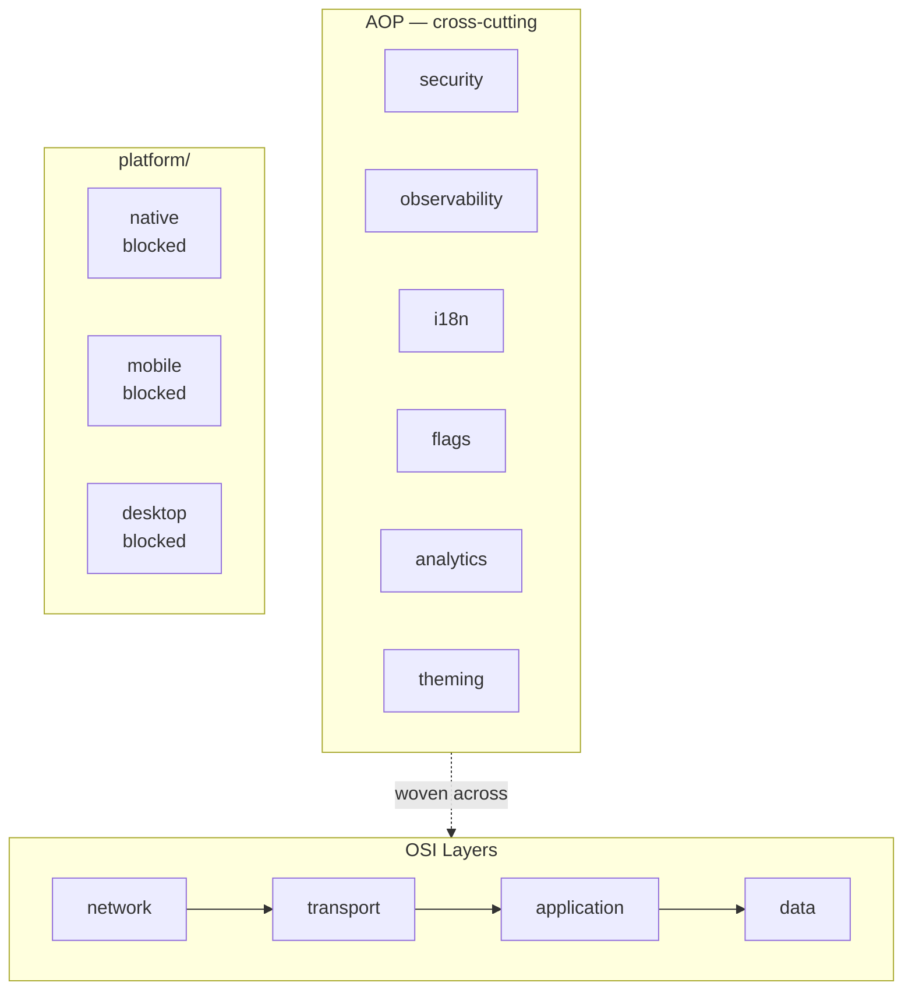
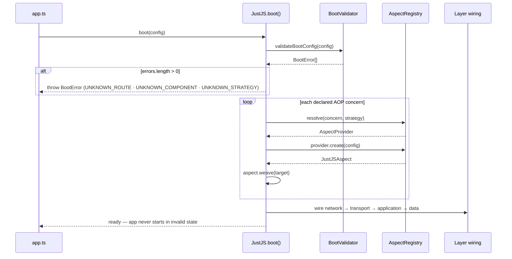
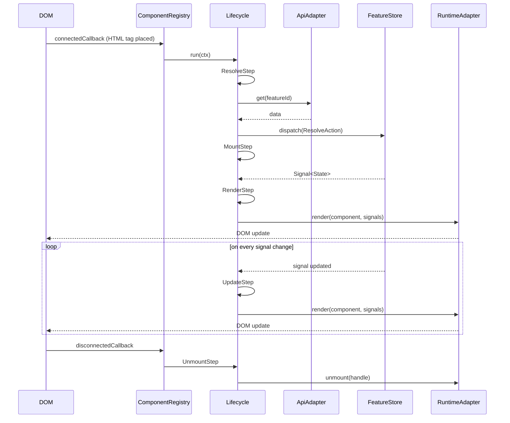
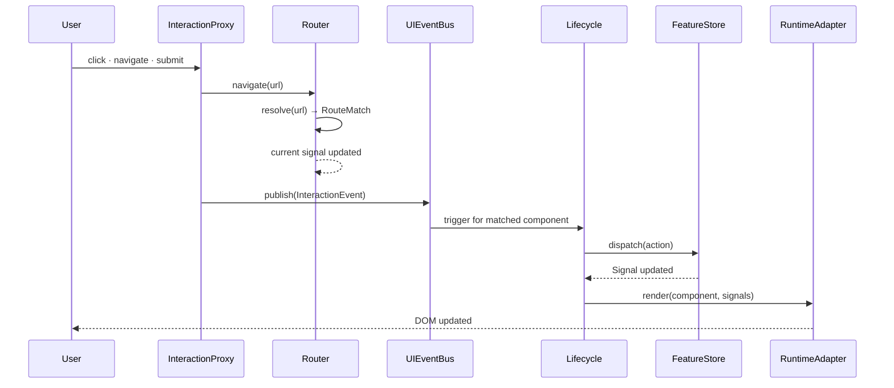
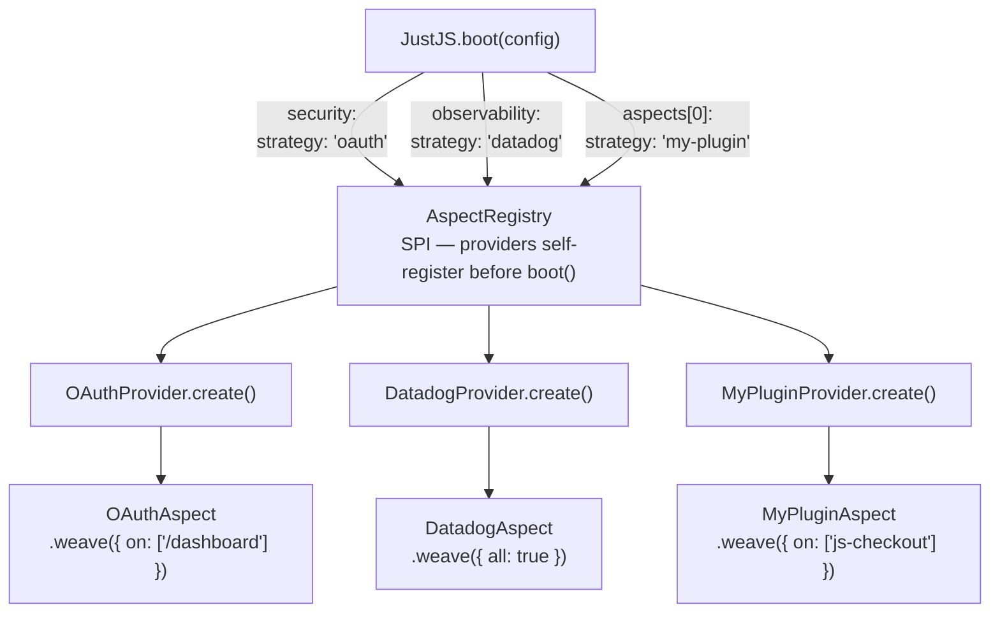

# JustJS — Architecture

## Overview

JustJS is the UI domain layer. The developer writes a `*_component.yaml` and places an HTML tag. Everything else flows — routing, auth, state, API transport, lifecycle, CSS, observability, platform delivery.

**Core principle:** all wiring is declared at boot time by strategy name, resolved through SPI, never by direct import. Swap a strategy name; nothing else changes.

---

## Workspace structure

Every layer, every AOP concern, and every platform adapter is a **standalone workspace** — installable, buildable, testable, and runnable in complete isolation. `bun-workspace.yaml` at the repo root is a convenience only; nothing depends on it to function.



---

## Layer model

Modelled on the OSI stack — each layer has a single responsibility and depends only on layers below it.

```mermaid
flowchart LR
  subgraph osi[OSI Layers]
    direction TB
    D["data\nFeatureStore · Signals · UIEventBus"]
    A["application\nRouter · ComponentRegistry\nLifecycle · InteractionProxy"]
    T["transport\nApiAdapter · WsAdapter · CacheAdapter"]
    N["network\nfetch · WebSocket · Service Worker\nCustom Elements"]
    D --- A --- T --- N
  end

  subgraph aop[AOP — woven via JustJS.boot()]
    direction TB
    Sec[security]
    Obs[observability]
    I18n[i18n]
    Fl[flags]
    An[analytics]
    Th[theming]
  end

  aop -.->|weave| D
  aop -.->|weave| A
  aop -.->|weave| T
  aop -.->|weave| N
```

---

## AOP — Aspect-Oriented Programming

Concerns that do not belong to any single OSI layer are modelled as **aspects**. They are declared at boot time by strategy name, resolved through the SPI `AspectRegistry`, and woven onto their targets — never imported directly.

Each AOP workspace is standalone and ships its own strategy implementations. Third-party strategies are separate repos that self-register before `JustJS.boot()` is called.

```
aop/
  security/       — authentication, authorisation, route guards
  observability/  — logging, performance marks, error capture
  i18n/           — translation, locale switching
  flags/          — feature flag evaluation
  analytics/      — event tracking
  theming/        — design tokens, CSS custom properties
```

Errors are **not** an AOP concern — each layer's `api/` defines its own specific error types.

---

## SAF — Service Abstraction Framework

Every workspace follows the same four-directory layout under `scm/main/src/`:

| Directory | Name | Role |
|---|---|---|
| `api/` | Contracts | Interfaces, errors, types — zero dependencies |
| `core/` | Implementations | Business logic — never imported by consumers |
| `saf/` | Service Abstraction Facade | Sole public export surface |
| `spi/` | Service Provider Implementation | Extension hooks — providers self-register here |

Consumers import only from a workspace's SAF surface. The `core/` implementations are an internal detail.

---

## Boot sequence



---

## Component lifecycle



---

## User interaction data flow



---

## Aspect weaving — SPI



---

## Interface inventory

Interfaces are organised by the workspace they belong to. Each workspace's `api/` defines its own contracts and error types.

### network/

| Interface | File |
|---|---|
| `RuntimeAdapter` | `api/runtime.ts` |

### transport/

| Interface | File |
|---|---|
| `ApiAdapter` | `api/transport.ts` |
| `WsAdapter`, `WsConnection` | `api/transport.ts` |
| `CacheAdapter` | `api/transport.ts` |

### application/

| Interface | File |
|---|---|
| `Component<Props, State, Events>` | `api/component.ts` |
| `ComponentContext` | `api/component.ts` |
| `MountHandle` | `api/component.ts` |
| `LifecycleStep`, `Lifecycle` | `api/lifecycle.ts` |
| `LifecycleEvent`, `LifecycleEventType` | `api/lifecycle.ts` |
| `Route`, `RouteMatch`, `Router` | `api/router.ts` |
| `ComponentRegistry` | `api/router.ts` |
| `InteractionProxy`, `InteractionEvent` | `api/router.ts` |
| `JustJSAspect`, `AspectProvider`, `AspectRegistry` | `api/aspect.ts` |
| `AspectTarget`, `AspectConfig`, `AspectDeclaration` | `api/aspect.ts` |
| `BootConfig`, `BootError` | `api/boot.ts` |
| `RoutesManifest`, `RegistryManifest`, `ImportMap` | `api/boot.ts` |

### data/

| Interface | File |
|---|---|
| `Signal<T>`, `WritableSignal<T>` | `api/store.ts` |
| `FeatureStore<T, Selector>` | `api/store.ts` |
| `Action`, `UIEventBus`, `UIEvent` | `api/store.ts` |

### aop/security/

| Interface | File |
|---|---|
| `Principal`, `UISecurityContext` | `api/security.ts` |
| `RouteGuard` | `api/security.ts` |

### aop/observability/

| Interface | File |
|---|---|
| `UIObserverContext`, `LogDrain` | `api/observer.ts` |

### aop/i18n/

| Interface | File |
|---|---|
| `I18nContext` | `api/i18n.ts` |

### aop/flags/

| Interface | File |
|---|---|
| `FlagsContext` | `api/flags.ts` |
