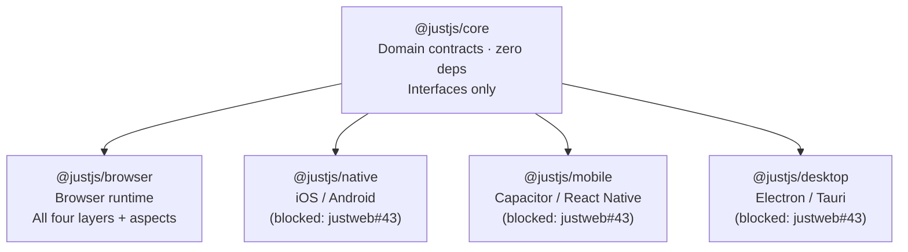
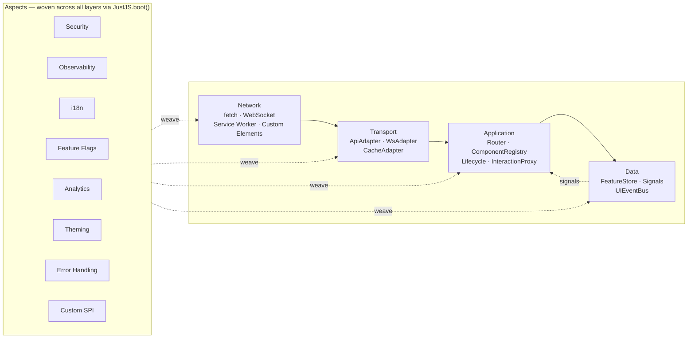
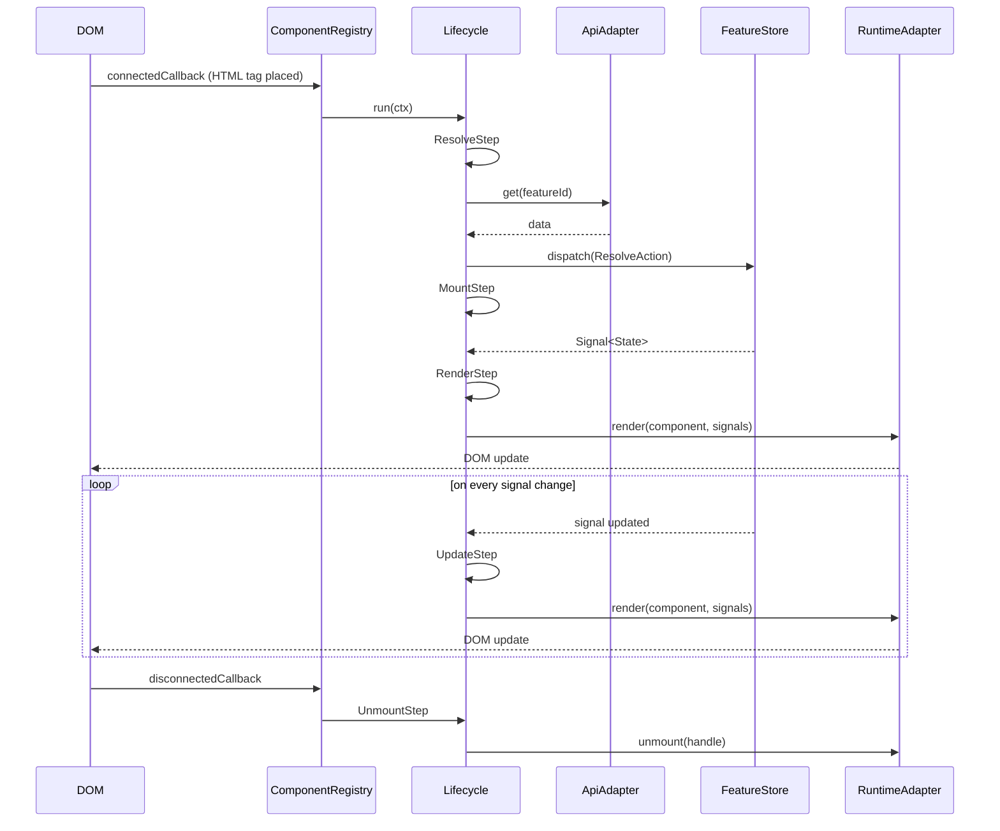
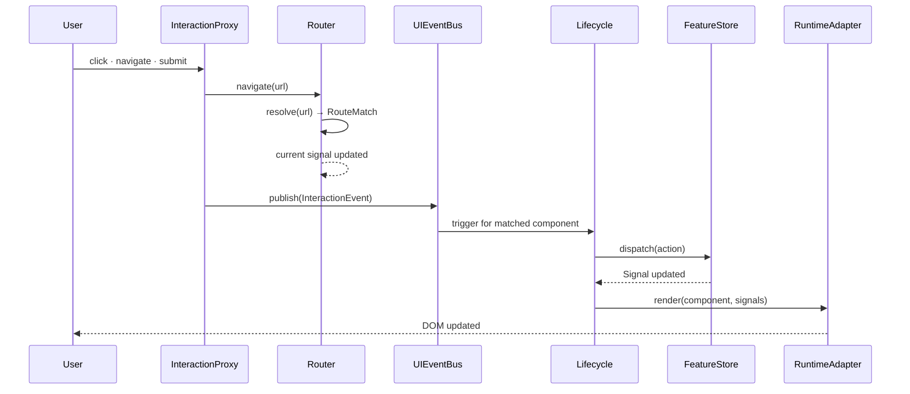
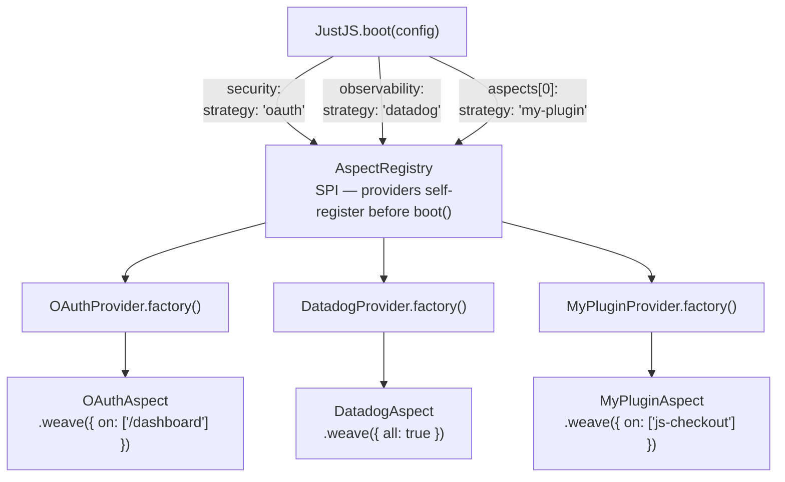

# JustJS — Architecture

## Overview

JustJS is the UI domain layer. The developer writes a `*_component.yaml` and places an HTML tag. Everything else flows — routing, auth, state, API transport, lifecycle, CSS, observability, platform delivery.

**Core principle:** all wiring is declared at boot time by strategy name, resolved through SPI, never by direct import. Swap a strategy name; nothing else changes.

---

## Package structure

---

## Layer model

---

## SAF — Service Abstraction Framework

Every package follows the same four-directory layout:

| Directory | Name | Role |
|---|---|---|
| `src/api/` | Contracts | Interfaces, errors, types — zero dependencies |
| `src/core/` | Implementations | Business logic — never imported by consumers |
| `src/saf/` | Service Abstraction Facade | Sole public export surface |
| `src/spi/` | Service Provider Implementation | Extension hooks — providers self-register |

Consumers import only from the SAF surface (`@justjs/core` or `@justjs/browser`). The `core/` implementations are an internal detail.

---

## Boot sequence

---

## Component lifecycle

---

## User interaction data flow

---

## Aspect weaving — SPI

---

## Interface inventory

### `@justjs/core`

| Interface | File | Layer |
|---|---|---|
| `Component<Props, State, Events>` | `api/component.ts` | Application |
| `ComponentContext` | `api/component.ts` | Application |
| `MountHandle` | `api/component.ts` | Application |
| `LifecycleStep`, `Lifecycle` | `api/lifecycle.ts` | Application |
| `LifecycleEvent`, `LifecycleEventType` | `api/lifecycle.ts` | Application |
| `Signal<T>`, `WritableSignal<T>` | `api/store.ts` | Data |
| `FeatureStore<T, Selector>` | `api/store.ts` | Data |
| `Action`, `UIEventBus`, `UIEvent` | `api/store.ts` | Data |
| `Principal`, `UISecurityContext` | `api/security.ts` | Cross-cutting |
| `RouteGuard` | `api/security.ts` | Cross-cutting |
| `Route`, `RouteMatch`, `Router` | `api/router.ts` | Application |
| `ComponentRegistry` | `api/router.ts` | Application |
| `InteractionProxy`, `InteractionEvent` | `api/router.ts` | Application |
| `ApiAdapter` | `api/transport.ts` | Transport |
| `WsAdapter`, `WsConnection` | `api/transport.ts` | Transport |
| `CacheAdapter` | `api/transport.ts` | Transport |
| `RuntimeAdapter` | `api/runtime.ts` | Network |
| `UIObserverContext`, `LogDrain` | `api/observer.ts` | Cross-cutting |
| `I18nContext` | `api/i18n.ts` | Cross-cutting |
| `FlagsContext` | `api/flags.ts` | Cross-cutting |
| `ErrorBoundary`, `ComponentErrorPhase` | `api/error_boundary.ts` | Cross-cutting |
| `JustJSAspect`, `AspectProvider` | `api/aspect.ts` | SPI |
| `AspectRegistry` | `api/aspect.ts` | SPI |
| `AspectTarget`, `AspectConfig`, `AspectDeclaration` | `api/aspect.ts` | SPI |
| `BootConfig`, `BootError` | `api/boot.ts` | Boot |
| `RoutesManifest`, `RegistryManifest`, `ImportMap` | `api/boot.ts` | Boot |
