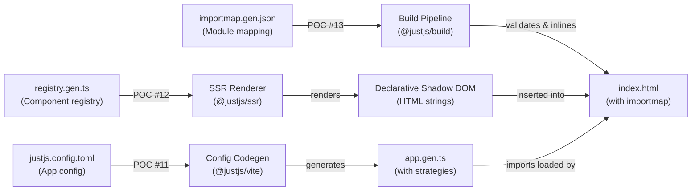
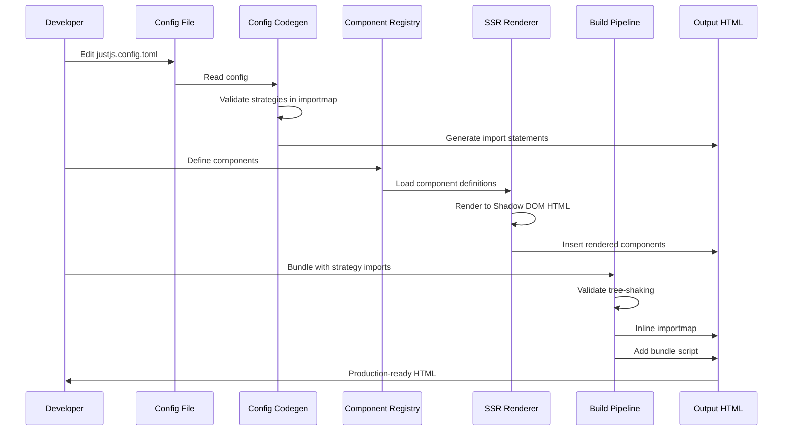
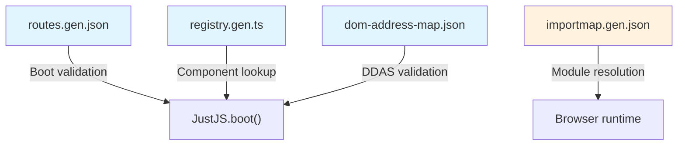

# E2E Build-Time Tooling Demo

End-to-end integration test demonstrating how JustJS build tools work together to generate production HTML.

## Purpose

This demo validates the **Contract Spec** architecture (see `docs/POC-CONTRACT-SPEC.md`):

1. **Stable artifacts** define the interface between build tools
2. **Three independent tools** consume these artifacts
3. **All three tools work together** to generate production-ready HTML

If this demo passes, the architecture is proven sound.

## Architecture



## Data Flow



## Tool Responsibilities

| Tool | Input | Output | Purpose |
|------|-------|--------|---------|
| **Config Codegen** | `justjs.config.toml` | Strategy imports in `app.gen.ts` | Injects configured strategies into boot code |
| **SSR Renderer** | Component definitions | Declarative Shadow DOM HTML | Server-side rendering without browser APIs |
| **Build Pipeline** | `importmap.gen.json` | Inlined importmap + bundle | Production bundling with static imports |

## Artifacts

All three tools consume **Contract Spec** artifacts (see `docs/POC-CONTRACT-SPEC.md`):



## Usage

### Run the demo

```bash
bun test scm/examples/e2e-tooling/e2e_test.ts
```

**Output:**
```
✓ test_e2e_config_codegen_reads_real_toml
✓ test_e2e_importmap_has_all_strategies
✓ test_e2e_routes_defines_valid_paths
✓ test_e2e_ssr_renders_button_to_html
✓ test_e2e_build_pipeline_validates_importmap
✓ test_e2e_inline_importmap_generates_html
✓ test_e2e_full_pipeline_integration

7 pass, 0 fail
```

### View generated HTML

```bash
cat scm/examples/e2e-tooling/output.html
```

Or open directly in browser:
```
C:\phd-systems\swelabs\justjs\scm\examples\e2e-tooling\output.html
```

## What the Demo Shows

**Config Codegen (POC #11):**
- ✅ Reads real `justjs.config.toml`
- ✅ Validates strategies exist in importmap
- ✅ Generates strategy imports

**SSR Renderer (POC #12):**
- ✅ Renders component to Declarative Shadow DOM
- ✅ No browser APIs required (server-side only)
- ✅ HTML string output

**Build Pipeline (POC #13):**
- ✅ Validates tree-shaking (all imports in importmap)
- ✅ Inlines importmap into HTML
- ✅ Generates production-ready structure

**Integration:**
- ✅ All three tools consume real artifacts
- ✅ Output is valid HTML ready to serve
- ✅ Importmap has no external resolution needed

## Output Example

Generated `output.html`:
```html
<!DOCTYPE html>
<html>
<head>
  <script type="importmap">
    {
      "imports": {
        "@justjs/core": "/vendor/core-v0.1.0.js",
        "@justjs/aop-security-oauth": "/vendor/security-oauth-v1.0.0.js",
        "@justjs/aop-observability-datadog": "/vendor/observability-datadog-v1.0.0.js",
        "@justjs/aop-flags-launchdarkly": "/vendor/flags-launchdarkly-v2.0.0.js"
      }
    }
  </script>
</head>
<body>
  <div id="app">
    <x-dashboard>
      <template shadowrootmode="open">
        <div class="dashboard-card">
          <h1>Welcome</h1>
          <slot></slot>
        </div>
      </template>
    </x-dashboard>
  </div>
  <script>
import { boot } from "@justjs/core"
import "@justjs/aop-security-oauth"
import "@justjs/aop-observability-datadog"
import "@justjs/aop-flags-launchdarkly"

async function init() {
  await boot()
}

init()
  </script>
</body>
</html>
```

## Related Documentation

- **Contract Spec:** `docs/POC-CONTRACT-SPEC.md` — Artifact shapes and semver guarantees
- **Config Codegen:** `tooling/vite/scm/main/README.md` — POC #11
- **SSR Renderer:** `tooling/ssr/scm/main/README.md` — POC #12
- **Build Pipeline:** `tooling/build/scm/main/README.md` — POC #13

## Key Design Decisions

### Why Declarative Shadow DOM?

Instant rendering without JavaScript:
- ✅ No Custom Elements API required on server
- ✅ HTML renders immediately in browser
- ✅ Seamless hydration when Custom Elements load
- ✅ No flash of unstyled content (FOUC)

### Why Inlined Importmap?

No external import resolution at runtime:
- ✅ All dependencies known at build time
- ✅ No fallback/polyfill needed in browser
- ✅ Tree-shaking verified before deploy
- ✅ Predictable module resolution

### Why Three Separate Tools?

Each tool has one responsibility:
- ✅ **Config Codegen** — Strategy injection
- ✅ **SSR** — Component rendering
- ✅ **Build** — Bundling + importmap

Enables:
- Independent tool updates
- Easy to test each in isolation
- Clear contract between tools
- Swappable implementations

## Validation Checklist

- [x] Config codegen reads real TOML
- [x] Config codegen validates strategies
- [x] Importmap has all configured strategies
- [x] Routes defines valid paths
- [x] SSR renders components to Shadow DOM
- [x] Build pipeline validates tree-shaking
- [x] Build pipeline inlines importmap
- [x] Generated HTML is valid
- [x] All three tools work together
- [x] Output is production-ready

## Next Steps

Once this demo is validated:

1. **Integration tests** — Verify with real component implementations
2. **Performance benchmark** — Measure rendering + bundling time
3. **End-user docs** — Document tool usage for app developers
4. **Tool CLI** — Create command-line interfaces for each tool
5. **Build system integration** — Wire into production build pipeline
